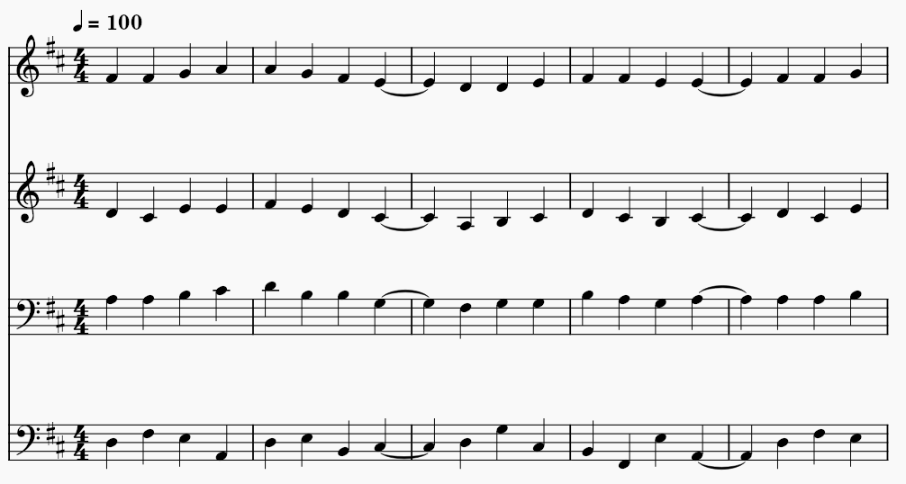

# MPPI Voice Leading Solver

A Python system that takes a soprano melody and outputs a complete SATB (soprano, alto, tenor, bass) harmonization using Model Predictive Path Integral (MPPI) control. Instead of hard constraint trees, we treat voice leading as a trajectory optimization problem: sample many possible futures, score them with a cost function encoding music theory rules, and pick the best path.



## Install

Python 3.10 or newer is recommended. From inside this folder:

```bash
pip install numpy mido pygame
```

- **numpy** is used for the chord prior matrix and weighted sampling.
- **mido** writes the MIDI file.
- **pygame** plays the MIDI through the system's MIDI synth.

A note on pygame: it occasionally needs platform-specific dependencies (SDL2 on Linux, an actual MIDI synthesizer like the macOS built-in or Windows GS Wavetable Synth). If `pip install pygame` fails or the audio doesn't play, the MIDI file is still saved to disk and can be opened in MuseScore, Finale, or any DAW.

## Quick start

Pick any of the four example songs and run it. Each file harmonizes a hardcoded melody, prints the result, saves a MIDI file, and plays it through pygame:

```bash
python example_ode_to_joy.py     # Beethoven, D major
python example_twinkle.py        # C major
python example_amazing_grace.py  # G major
python example_jingle_bells.py   # C major
```

The MIDI files (`ode_to_joy.mid`, etc.) can be opened in MuseScore, Finale, or any notation software for a real score.

## Pipeline

```text
soprano melody  ->  MPPI solver  ->  4-voice SATB chord progression  ->  MIDI / pygame
```

The MPPI solver:

1. For each note, pre-computes every (chord, voicing) that fits the singing ranges
2. For each beat, samples many random "futures" looking 4 beats ahead
3. Scores each future using the cost function
4. Commits to the best first step, advances, repeats

## What's in this project

The main entry point:

- **`harmonize.py`** - the MPPI loop, MIDI export, and pygame playback. Imports from all the demo modules below.
- **`example_*.py`** - one file per song. Each contains the soprano melody and calls `harmonize()`.

The demo modules (each runnable on its own to show one concept):

- **`music_basics.py`** - shared foundation: MIDI notes, pitch classes, the major scale, triad shapes, and voice ranges. Everything else imports from here.
- **`chord_demo.py`** - given a Roman numeral and a key, print the chord's notes.
- **`voicing_demo.py`** - given a chord and a soprano note, find every valid 4-voice arrangement.
- **`cost_demo.py`** - the rule engine. Scores chord transitions using music theory rules (parallel fifths/octaves, smooth motion, contrary outer voices, leading tone resolution, cadences, retrogression, etc.).
- **`progression_demo.py`** - the chord transition prior from Kostka/Payne, visualized as histograms. This is what MPPI samples from.
- **`edge_cases.py`** - tests for tricky inputs (soprano at lowest/highest note, soprano not in chord, surveying which chords can voice a given note).

## Tuning a harmonization

Each example calls `harmonize()` with a few knobs:

- **`chord_change_every`** - 1 for busy melodies (Ode to Joy), 2 for slower folk songs (most others). Higher numbers hold each chord across more beats.
- **`long_beats`** - 1-indexed beat numbers that are written as half notes instead of quarters. Used at phrase ends so the melody breathes naturally.
- **`bpm`** - tempo in beats per minute.
- **`num_samples`** / **`lookahead`** - more samples + longer lookahead = better quality but slower.

## Attributions

Based on concepts from Schmeling, *Berklee Music Theory Book 1* (2nd ed., Berklee Press, 2011).

This project was developed with assistance from AI tools (Claude). Specifically:

- **Music theory checking** - AI was consulted throughout to verify that our encoded rules match conventional music theory. This includes cross-checking the Kostka/Payne chord transition priors, the list of common voicing rules (parallel fifths, doubled leading tones, etc.), the rules for tendency tone resolution, and the distinction between strict rules and stylistic preferences. Any rule we encode as a cost term was double-checked against textbook practice before inclusion.
- **Writing assistance** - AI helped draft this README. All was reviewed and edited by us before committing.
- **Code structure** - the general skeleton and the demo organization were developed in dialogue with AI.

All code in this repository is run, tested, and understood by us.
